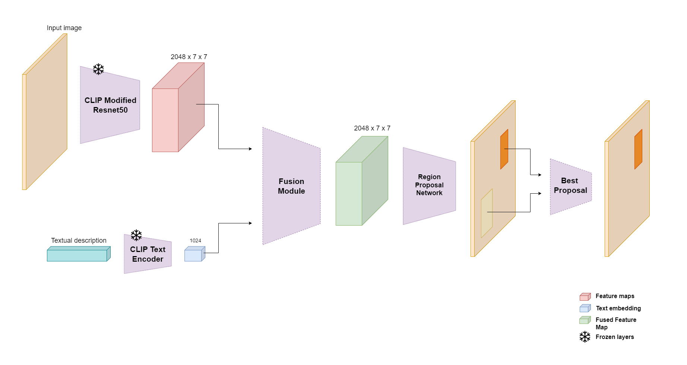

# ClipRPN - Deep Learning Project
[[Notebook]](/notebooks/report.ipynb)

This repository contains the implementation of ClipRPN, a visual grounding
framework developed as a project for the Deep Learning course at the University
of Trento.

## Requirements
Before getting started, make sure you have the following dependencies installed:
torch, torchvision, and [CLIP](https://github.com/openai/CLIP). Additionally, if
you plan to use the Baseline module, which is based on Yolo, you'll need to
install its dependencies as well.

To install the CLIP dependencies, run the following commands:
```bash
$ pip install ftfy regex tqdm torchmetrics torchvision
$ pip install git+https://github.com/openai/CLIP.git
```

To install the Yolo dependencies, use the following command:
```bash
$ pip install -U ultralytics
```

## Usage
To use the ClipRPN framework for visual grounding on the RefCOCOg dataset, follow the instructions below:
```bash
usage: __main__.py [-h] -d PATH [-i ID] [-m {baseline,concatenation,attention}] [-b BATCH_SIZE] [-e] [-t NUM_EPOCHS]

options:
  -h, --help            show this help message and exit
  -d PATH, --dataset PATH
                        Location of the RefCOCOg dataset.
  -i ID, --inference ID
                        Specifies the image ID from the test dataset on which to perform inference. To execute the inference,
                        it is necessary to specify the model using the `-m` option.
  -m {baseline,concatenation,attention}, --model {baseline,concatenation,attention}
                        Defines the type of model to be used during training. The available options are as follows: -
                        'baseline': This option utilizes a training-free model that combines YOLO with CLIP. -
                        'concatenation': This option uses a model that employs simple concatenation with the textual
                        description. - 'attention': This option represents our final model, which utilizes cross attention to
                        fuse text and images.
  -b BATCH_SIZE, --batch_size BATCH_SIZE
                        Batch size for the data loaders.
  -e, --evaluate        Evaluate the following metrics for the specified model: oIOU, Recall, Cosine Similarity.
  -t NUM_EPOCHS, --train NUM_EPOCHS
                        Train the specified model for the specified amount of epochs.

```

#### Examples
* Training: the provided command performs model training with the cross attention fusion module for 10 epochs using the RefCOCOg dataset located at `/path/to/refcocog`.

```bash
python src/__main__.py -d /path/to/refcocog -m attention -t 10
```
* Eevaluation: the provided command performs model evaluation with the cross attention fusion module using the test split of the RefCOCOg dataset located at `/path/to/refcocog`.

```bash
python src/__main__.py -d /path/to/refcocog -m attention -e
```

* Inference: here's an example of how to perform inference on the first image of the test dataset(id 0) and visualize the predicted result using the cross attention fusion module:

```bash
python src/__main__.py -d /path/to/refcocog -i 0 -m attention -e
```

## The goal of the project
Visual grounding involves linking language and perception by grounding
linguistic symbols in the visual world. The goal of this assignment is to build,
fine-tune, and evaluate a deep learning framework that can perform visual
grounding on a given dataset.

The assignment focuses on training a deep learning framework for visual
grounding using the CLIP (Contrastive Language-Image Pre-training) model as a
foundation. CLIP is a pre-trained model that provides a starting point for
transfer learning, allowing us to leverage its capabilities in image-text
understanding for the visual grounding task. The objective is to fine-tune CLIP
specifically for visual grounding, which requires predicting bounding boxes in
images corresponding to the entities described in textual descriptions.

#### The Dataset
This visual grounding task utilizes the RefCOCOg dataset, a variant of the
Referring Expression Generation (REG) dataset. It consists of approximately
25,799 images, each with an average of 3.7 referring expressions. The dataset
contains appearance-based descriptions independent of viewer perspective, making
it suitable for visual grounding. Accurate bounding boxes need to be generated
around the referred objects in the images, considering the context and visual
properties.

#### Our solution: ClipRPN
In the following diagram we present a high-level representation of our proposed
framework. The architecture begins by converting an image and a textual
description into a feature map and text embedding. This is achieved using the
ResNet50 of CLIP (excluding the last attention layer) for the image and the text
encoder of CLIP for the textual input. The feature map and text embedding are
then jointly processed using a fusion module, resulting in a fused feature map.
This fused feature map is subsequently feeded into the Region Proposal Network
to generate region proposals that are conditioned on the textual description.
The model returns the region with the highest score as the final outcome.



To gain a comprehensive understanding of the suggested approach and its entire
process, please refer to the Jupyter notebook accompanying this repository:
[/notebooks/report.ipynb](/notebooks/report.ipynb).
